# 🚀 MissionGuard AI

## AI-Powered Mission Operations & Decision Support Platform

MissionGuard AI is an AI-powered mission operations and decision-support platform built for the **Space Exploration Challenge**.

It transforms complex spacecraft telemetry and simulated space-object data into actionable mission insights using **machine learning, predictive analytics, deterministic risk assessment, mission planning, simulated Space Situational Awareness (SSA), and an evidence-grounded AI Mission Copilot**.

> **Hackathon Prototype:** MissionGuard AI uses simulated telemetry and space-object data. It is a decision-support system and does **not** autonomously control spacecraft.

---

## 🌐 Live Demo

**Frontend:**
https://missionguard-ai-frontend.onrender.com

**Backend API:**
https://missionguard-ai.onrender.com

**API Documentation:**
https://missionguard-ai.onrender.com/docs

**Demo Video:**
https://youtu.be/Ve6DscDi-Yg

---

# 🎯 Problem

Mission operators must process large volumes of spacecraft telemetry while making time-sensitive decisions.

A single mission can involve:

- Continuous telemetry streams
- Multiple spacecraft subsystems
- Unexpected anomalies
- Future parameter degradation
- Mission-level risk
- Activity feasibility constraints
- Potential orbital conjunctions
- Large amounts of operational evidence

The challenge is not simply detecting an abnormal value.

Operators need to answer:

> **What happened? Why did it happen? How serious is it? What could happen next? What should we consider doing?**

MissionGuard AI addresses this workflow through:

```text
DETECT → EXPLAIN → PREDICT → ASSESS → RECOMMEND
```

---

# 💡 Solution

MissionGuard AI provides a unified mission operations environment combining:

- 🛰️ ML-powered anomaly detection
- 📈 Predictive telemetry forecasting
- ⚠️ Deterministic mission risk assessment
- 🧭 Mission activity feasibility analysis
- 🌌 Simulated Space Situational Awareness
- 🧠 Evidence-grounded AI Mission Copilot
- 📊 Mission reporting and analytics
- 🚀 Multi-spacecraft Mission Control Dashboard

The platform follows a **human-in-the-loop architecture**.

Critical calculations are performed by deterministic and ML components. The AI reasoning layer explains and contextualizes those results instead of independently generating mission-critical scores.

---

# ⭐ What Makes MissionGuard AI Different?

Most monitoring systems stop at:

```text
Telemetry → Alert
```

MissionGuard AI extends the workflow:

```text
Telemetry
    ↓
ML Detection
    ↓
Evidence
    ↓
Prediction
    ↓
Risk Assessment
    ↓
Mission Planning
    ↓
SSA / Conjunction Awareness
    ↓
AI Explanation
    ↓
Operator Decision Support
```

This creates a complete **mission intelligence loop** rather than a standalone anomaly detector.

---

# 🧠 Core Architecture

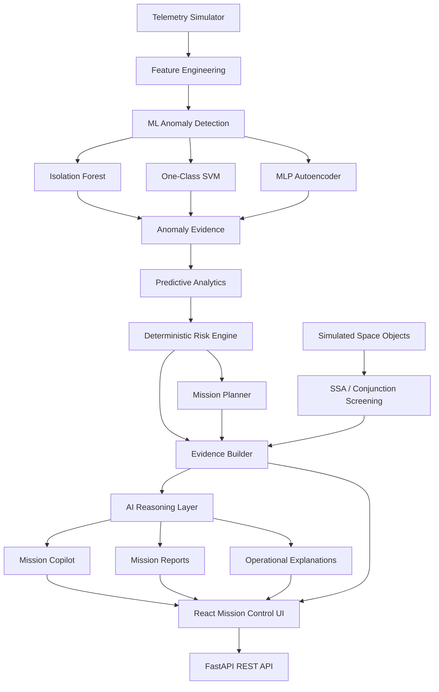

---

# 🛰️ Mission Intelligence Pipeline

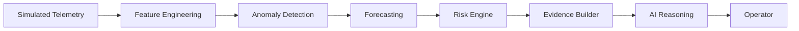

### Design Principle

**Critical calculations remain deterministic or ML-based.**

The AI layer is responsible for:

- Explanation
- Contextualization
- Evidence synthesis
- Natural-language reasoning
- Operator assistance

It does **not** independently calculate mission-critical risk scores or execute spacecraft commands.

---

# 🤖 ML Anomaly Detection

MissionGuard AI supports multiple anomaly-detection approaches:

### 1. Isolation Forest

Used for identifying telemetry observations that differ significantly from normal operating patterns.

### 2. One-Class SVM

Provides an alternative unsupervised approach for identifying observations outside the learned normal operating boundary.

### 3. MLP Autoencoder

An `MLPRegressor`-based reconstruction approach identifies anomalous telemetry using reconstruction error.

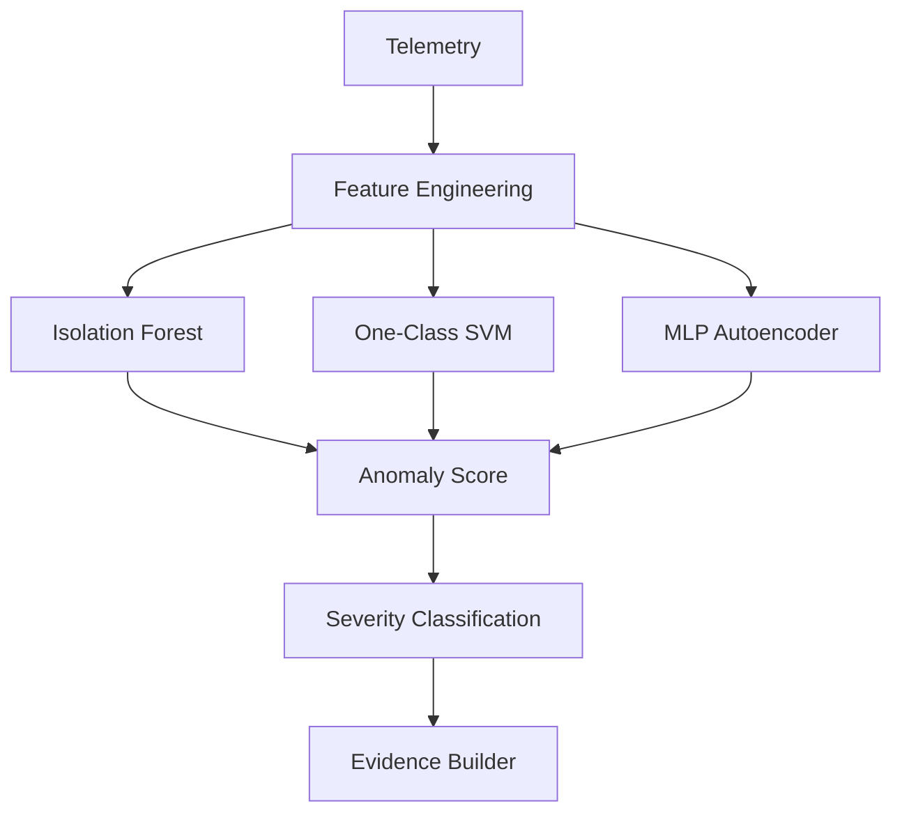

The system also contains an evaluation pipeline for comparing detector behavior against simulated ground truth.

---

# 📈 Predictive Analytics

MissionGuard AI forecasts important telemetry parameters to identify potential future problems before they become critical.

The prediction pipeline:

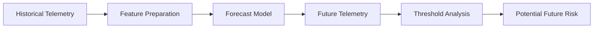

This allows operators to move from:

> **Reactive monitoring**

to:

> **Proactive mission monitoring**

---

# ⚠️ Deterministic Mission Risk Engine

The risk engine combines mission evidence to produce a consistent mission-level risk assessment.

Inputs can include:

- Anomaly severity
- Telemetry trends
- Subsystem criticality
- Forecast information
- Mission context

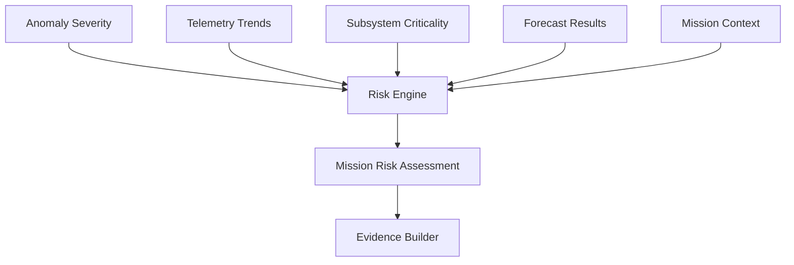

The risk engine is deterministic so that critical calculations remain:

- Explainable
- Reproducible
- Testable
- Auditable

---

# 🧭 Mission Planner

MissionGuard AI evaluates proposed mission activities against operational constraints.

The planner considers:

- ⚡ Power
- 🌡️ Thermal conditions
- ⛽ Fuel
- 📡 Communications
- 🛰️ Attitude constraints

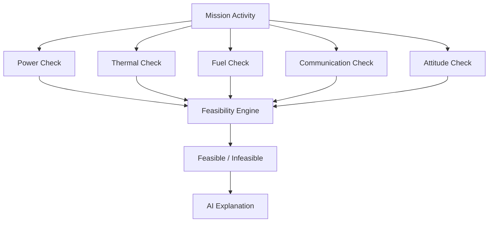

The feasibility result is generated by deterministic logic, while the AI layer provides supporting explanation.

---

# 🌌 Space Situational Awareness

MissionGuard AI includes a simulated Space Situational Awareness module.

It supports:

- Space-object summaries
- Simulated conjunction screening
- Closest-approach information
- Time-to-closest-approach
- Relative velocity
- Prototype risk classification
- AI-generated conjunction explanation

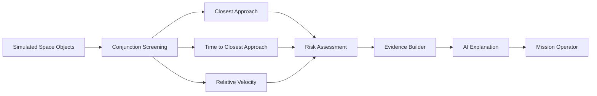

> ⚠️ **Important:** All space-object and conjunction data in this prototype is explicitly **SIMULATED**.

The system is intended to demonstrate the decision-support workflow rather than provide authoritative orbital collision predictions.

---

# 🧠 IBM Granite / AI Reasoning

MissionGuard AI integrates an AI reasoning layer designed around **IBM Granite / watsonx**.

The reasoning layer receives structured mission evidence rather than directly operating on uncontrolled raw telemetry.

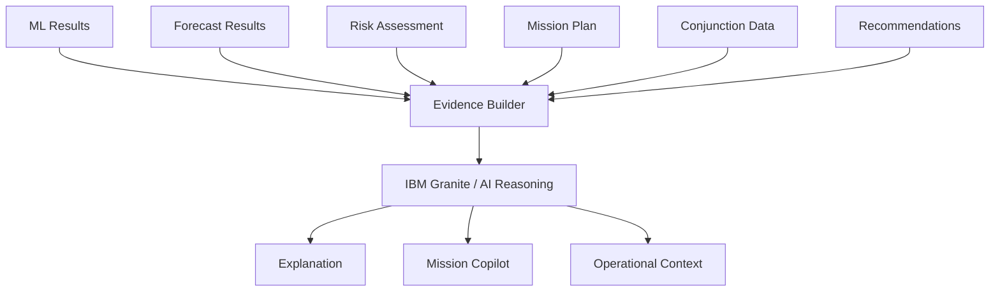

### Evidence-Grounded Reasoning

Instead of allowing the LLM to invent mission values, MissionGuard AI follows:

```text
SYSTEM CALCULATIONS
       ↓
STRUCTURED EVIDENCE
       ↓
AI REASONING
       ↓
EXPLANATION
       ↓
OPERATOR VALIDATION
```

This architecture helps reduce unsupported AI-generated mission claims.

### Fallback Reasoning

The prototype also includes a deterministic fallback reasoning provider so that the application can continue demonstrating its reasoning workflow when an external AI provider is unavailable.

---

# 🧠 AI Mission Copilot

The Mission Copilot provides operational assistance using structured mission evidence.

It can work with:

- Spacecraft status
- Recent anomalies
- Forecasts
- Risk assessments
- Mission plans
- Conjunction information
- Recommendations

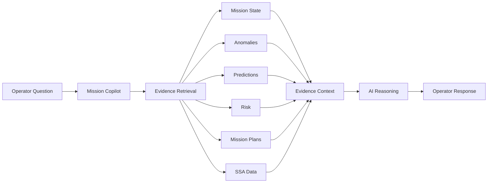

The Copilot is designed as an **operator-assistance layer**, not an autonomous spacecraft controller.

---

# 📊 Mission Reporting

MissionGuard AI can generate consolidated mission reports containing:

- Spacecraft health
- Telemetry insights
- Detected anomalies
- Predictions
- Risk assessments
- Recommendations
- Mission planning results
- Conjunction information

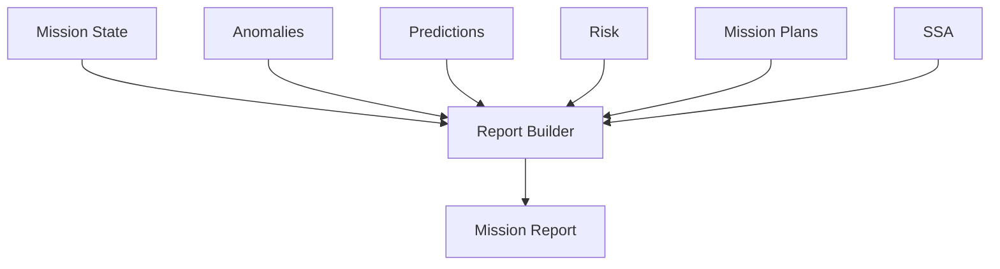

---

# 🔐 Human-in-the-Loop Safety

MissionGuard AI is designed as a **decision-support system**, not an autonomous spacecraft-control system.

### Safety principles

- Critical calculations remain deterministic or ML-based.
- AI explanations are grounded in structured evidence.
- AI recommendations require operator validation.
- No endpoint executes spacecraft commands.
- Simulated data is clearly identified.
- The prototype is not flight-certified.

```text
AI ASSISTS
    ↓
SYSTEM PROVIDES EVIDENCE
    ↓
OPERATOR REVIEWS
    ↓
OPERATOR DECIDES
```

> **Operator validation required.**

---

# 🛠️ Technology Stack

## Frontend

- React
- Vite
- Tailwind CSS
- Recharts
- React Router
- Axios
- Lucide Icons

## Backend

- Python
- FastAPI
- Pydantic
- Uvicorn

## AI / ML

- scikit-learn
- NumPy
- Pandas
- IBM Granite / watsonx integration
- Deterministic fallback reasoning

## Testing

- Pytest
- FastAPI TestClient

## Deployment

- Render
- Public React frontend
- Public FastAPI backend
- REST API architecture

---

# 📁 Project Structure

```text
missionguard-ai/
│
├── backend/
│   ├── app/
│   │   ├── api/
│   │   ├── core/
│   │   ├── ml/
│   │   ├── schemas/
│   │   └── services/
│   │
│   ├── tests/
│   └── requirements.txt
│
├── frontend/
│   ├── src/
│   │   ├── components/
│   │   ├── pages/
│   │   ├── services/
│   │   └── store/
│   │
│   └── package.json
│
├── docs/
│   ├── architecture/
│   ├── ai/
│   ├── evaluation/
│   └── testing/
│
└── README.md
```

---

# 🚀 Getting Started

## 1. Clone the Repository

```bash
git clone <repository-url>
cd missionguard-ai
```

---

## 2. Start the Backend

```bash
cd backend

python -m venv .venv
```

### Windows

```powershell
.\.venv\Scripts\Activate.ps1
```

Install dependencies:

```bash
pip install -r requirements.txt
```

Start FastAPI:

```bash
python -m uvicorn app.main:app --reload --port 8000
```

Backend documentation:

```text
http://127.0.0.1:8000/docs
```

---

## 3. Start the Frontend

Open another terminal:

```bash
cd frontend
npm install
npm run dev
```

The frontend will be available through the Vite development server.

---

# 🔧 Environment Variables

For local development, configure the required environment variables according to the backend configuration.

Example frontend configuration:

```env
VITE_API_URL=http://127.0.0.1:8000/api
```

For the deployed frontend, the API URL should point to the deployed backend:

```env
VITE_API_URL=https://missionguard-ai.onrender.com/api
```

> Do not expose private API keys or secrets in the frontend.

---

# 🧪 Testing

Run the backend test suite:

```bash
cd backend
python -m pytest tests/ -v
```

The test suite covers areas including:

- ML anomaly detection
- Forecasting
- Risk assessment
- Mission planning
- Conjunction screening
- API endpoints
- End-to-end mission workflow
- AI provider fallback behavior

---

# 🔌 API Overview

The backend exposes REST endpoints for the major mission workflows.

### Health

```text
GET /api/health
```

### Spacecraft

```text
GET /api/spacecraft
```

### Telemetry

```text
POST /api/telemetry/simulate
GET  /api/telemetry/{mission_id}
GET  /api/missions/{mission_id}/status
```

### Anomalies

```text
GET  /api/anomalies
GET  /api/anomalies/{mission_id}/{anomaly_id}
POST /api/anomalies/{mission_id}/{anomaly_id}/status
GET  /api/predictions/{mission_id}
POST /api/ai/explain
GET  /api/recommendations
```

### Mission Planner

```text
POST /api/mission-planner/evaluate
GET  /api/mission-planner/{mission_id}
```

### Space Situational Awareness

```text
GET  /api/space-objects/summary
POST /api/conjunctions/screen
GET  /api/conjunctions
GET  /api/conjunctions/{mission_id}/{conjunction_id}/explain
```

### Model Evaluation

```text
GET /api/models/evaluate
GET /api/models/evaluate-forecast
```

### Reports

```text
POST /api/reports/generate
GET  /api/reports/{mission_id}
```

### API Documentation

```text
https://missionguard-ai.onrender.com/docs
```

---

# 🎬 Demo Flow

The recommended demonstration follows the complete mission intelligence workflow:

```mermaid
flowchart LR

    A[Mission Dashboard]
    B[Generate Telemetry]
    C[Observe Health]
    D[Inspect Anomaly]
    E[View Prediction]
    F[Assess Risk]
    G[Mission Planner]
    H[SSA Screening]
    I[Mission Copilot]
    J[Generate Report]

    A --> B
    B --> C
    C --> D
    D --> E
    E --> F
    F --> G
    G --> H
    H --> I
    I --> J
```

### Demo sequence

1. Open Mission Control Dashboard
2. Select spacecraft and mission scenario
3. Generate simulated telemetry
4. Observe spacecraft health
5. Open Anomaly Center
6. Inspect anomaly evidence
7. Show AI explanation
8. Review predictions
9. Review mission risk
10. Evaluate a mission activity
11. Run conjunction / SSA screening
12. Explain a conjunction
13. Ask Mission Copilot a mission question
14. Generate a consolidated mission report

---

# 🏆 Challenge Alignment

MissionGuard AI was developed for the:

## **Space Exploration Challenge**

The project addresses mission operations through the combination of:

| Challenge Area          | MissionGuard AI                           |
| ----------------------- | ----------------------------------------- |
| Spacecraft Monitoring   | Telemetry simulation + health dashboard   |
| Machine Learning        | Multiple anomaly detection models         |
| Predictive Intelligence | Telemetry forecasting                     |
| Decision Support        | Deterministic risk engine                 |
| AI Reasoning            | IBM Granite / evidence-grounded reasoning |
| Mission Planning        | Constraint-based feasibility evaluation   |
| Space Awareness         | Simulated conjunction screening           |
| Human Oversight         | Operator-in-the-loop workflow             |

---

# 🤖 How IBM Bob Was Used

**IBM Bob was used as the primary development environment/tool during the implementation of MissionGuard AI.**

The development workflow used IBM Bob to assist with:

- Project architecture
- Backend implementation
- Frontend development
- API integration
- ML pipeline development
- AI reasoning integration
- Refactoring
- Debugging
- Testing
- Documentation
- Deployment preparation

IBM Bob supported an iterative development process where features were implemented, tested, reviewed, and refined throughout the project.

The final system combines IBM-assisted development with **IBM Granite / watsonx-oriented AI reasoning** and a deterministic fallback architecture.

---

# 🧩 End-to-End System Flow

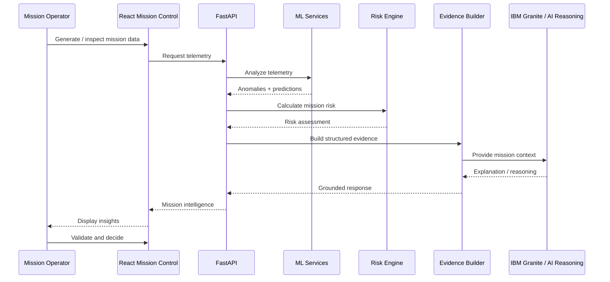

---

# 🔬 Why the Architecture Matters

MissionGuard AI intentionally separates **calculation** from **reasoning**.

### Calculation layer

Responsible for:

- Anomaly detection
- Forecasting
- Risk scoring
- Mission feasibility
- Conjunction screening

### AI reasoning layer

Responsible for:

- Explanation
- Context
- Evidence synthesis
- Natural-language assistance
- Operator interaction

This separation improves:

- Explainability
- Reproducibility
- Testability
- Safety
- Human oversight

---

# ⚠️ Prototype Limitations

MissionGuard AI is a hackathon prototype.

### Data limitations

Telemetry and space-object data are simulated.

### Orbital limitations

The conjunction system does not represent an authoritative operational orbital-analysis service.

### AI limitations

AI explanations depend on the structured evidence supplied to the reasoning layer.

### Risk limitations

Prototype risk classifications should not be interpreted as real collision probabilities.

### Operational limitations

The system does not control spacecraft or issue flight commands.

---

# 🔮 Future Improvements

Potential future development includes:

- Integration with real spacecraft telemetry sources
- Real orbital tracking datasets
- Covariance-aware conjunction analysis
- More advanced time-series forecasting
- Probabilistic collision-risk estimation
- Real-time telemetry streaming
- Advanced mission simulation
- More sophisticated uncertainty quantification
- Role-based mission operations
- Audit trails for operator decisions
- Advanced AI tool orchestration
- Additional IBM Granite / watsonx capabilities

---

# 👥 Team

## MissionGuard AI

Built for the **Space Exploration Challenge**.

---

# 📌 Hackathon Submission

### Required Deliverables

- ✅ Working MissionGuard AI prototype
- ✅ IBM Bob used during development
- ✅ IBM SkillsBuild learning activity
- ✅ Public GitHub repository
- ✅ Comprehensive README
- ✅ Publicly accessible deployed prototype
- ✅ Public demo/presentation video
- ✅ Challenge submission page

---

# ⚠️ Prototype Disclaimer

MissionGuard AI is a **hackathon prototype**.

Telemetry, mission scenarios, anomaly events, and space-object data are simulated and should not be interpreted as real spacecraft or authoritative orbital data.

The platform is a **decision-support system** and is not flight-certified.

It must not be used for real spacecraft operations, collision avoidance, or autonomous mission control.

> **Operator validation is required for all operational decisions.**

---

# 🚀 MissionGuard AI

### Detect. Explain. Predict. Assess. Recommend.

**Turning spacecraft data into mission intelligence.**
