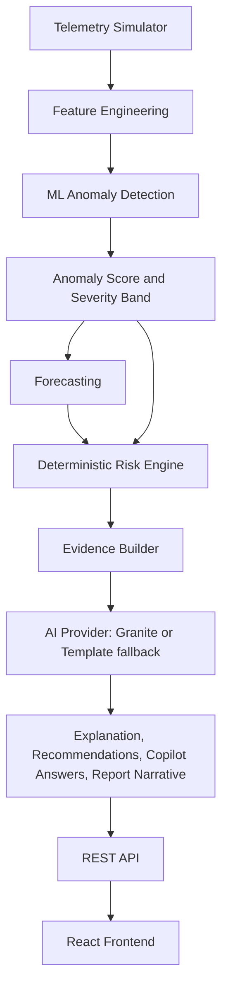

# MissionGuard AI — Architecture

## 1. Overview

MissionGuard AI is a mission operations and decision-support platform. It ingests simulated spacecraft telemetry, runs it through a machine-learning anomaly detection and forecasting pipeline, applies a deterministic risk engine, and hands the resulting structured evidence to an AI reasoning layer (IBM Granite / watsonx, with a deterministic offline fallback) for natural-language explanation, recommendations, Mission Copilot answers, and report narratives.

The system also includes a deterministic Mission Planner (activity feasibility checking) and a simulated Space Situational Awareness / conjunction-screening module.

## 2. High-Level Data Flow



**Architectural rule enforced throughout the codebase:** every number (anomaly score, risk score, forecast trend, feasibility verdict) is produced by ML or deterministic code. The AI provider only ever receives a pre-computed, structured `EvidencePackage` (or an equivalent structured object for Mission Planner / conjunctions) and turns it into natural language — it never calculates a score and never sees raw telemetry directly.

## 3. Backend Architecture (FastAPI)

```
backend/app/
├── main.py              FastAPI app, router registration, CORS, request-logging middleware
├── api/                  one file per route group (see API.md)
│   ├── health.py, spacecraft.py, telemetry.py, anomalies.py,
│   │   copilot.py, reports.py, mission_planner.py, ssa.py, evaluation.py
│   └── deps.py           single shared AI-provider instance used by every route
├── core/
│   └── config.py         environment variables, thresholds, subsystem criticality weights
├── schemas/
│   └── models.py         all Pydantic request/response models
├── ml/
│   ├── features.py        raw parameter list, rolling-window feature engineering
│   ├── anomaly.py         AnomalyDetector interface + 3 implementations, scoring
│   ├── forecasting.py     linear trend forecasting per telemetry parameter
│   └── evaluation.py       precision/recall/F1/FPR and MAE/RMSE evaluation
└── services/
    ├── simulator.py       deterministic, seeded telemetry generator
    ├── pipeline.py         orchestrates simulator -> ML -> forecast -> risk
    ├── risk.py              deterministic multi-factor risk engine
    ├── evidence.py          builds the structured EvidencePackage handed to the AI provider
    ├── explain.py            GraniteProvider interface, WatsonxGraniteProvider, TemplateExplanationProvider
    ├── copilot_tools.py     named functions the Copilot dispatches to (no arbitrary data access)
    ├── mission_planner.py    deterministic feasibility engine
    ├── ssa.py                 simulated conjunction-screening generator
    └── store.py               in-memory data store (stands in for a database)
```

### Data store

`app/services/store.py` is an **in-memory Python dictionary store**, not a database. It holds telemetry, anomalies, recommendations, reports, a small spacecraft registry (seeded with three demo spacecraft), mission-plan evaluations, conjunction events, an audit log, and Copilot chat history — all keyed by `mission_id` (or `spacecraft_id` for the roster). Restarting the backend process clears all state. There is no MongoDB or other persistent database wired into this build; `MONGODB_URI`/`MONGODB_DB` exist in `config.py` but are not read by any code path.

## 4. Frontend Architecture (React + Vite)

```
frontend/src/
├── main.jsx, App.jsx       router setup, page routes
├── api/client.js            single axios client, one function per backend endpoint
├── store/MissionContext.jsx  React context: active mission/spacecraft id, shared scenario state
├── components/               Layout (nav + top bar), HealthGauge, TelemetryChart,
│                              StatusPill, ScenarioControl, PanelWidgets, Explainability
└── pages/
    ├── Dashboard.jsx             Command Center: fleet roster, health gauge, telemetry chart, alerts, AI briefing
    ├── TelemetryExplorer.jsx     per-parameter chart + forecast panel
    ├── AnomalyCenter.jsx          anomaly list + detail drawer with AI explanation and contributor bars
    ├── MissionPlanner.jsx         proposed-activity form + feasibility result
    ├── SpaceSituationalAwareness.jsx  conjunction screening table + AI explanation
    ├── Copilot.jsx                 chat interface
    └── Reports.jsx                  report generation + display
```

The frontend is plain JavaScript (no TypeScript), styled with Tailwind CSS v4 using a dark mission-control color system defined in `index.css`. Charts use Recharts. The Vite dev server proxies `/api` requests to the backend; in production the frontend calls relative `/api/...` paths, so it has no hardcoded backend host.

## 5. Anomaly Lifecycle

1. `POST /api/telemetry/simulate` generates a seeded telemetry run (`app/services/simulator.py`).
2. `app/services/pipeline.py` builds features, runs the selected `AnomalyDetector`, and produces a 0-100 anomaly score per point, mapped to `NORMAL`/`LOW`/`WARNING`/`CRITICAL`.
3. A hysteresis/debounce pass (`analyze_run` in `pipeline.py`) merges contiguous `WARNING`/`CRITICAL` points into a single `Anomaly` record rather than one per point, so a signal oscillating near the threshold doesn't fragment into many near-duplicate incidents.
4. `app/services/risk.py` combines active anomaly scores, forecast trend, and per-subsystem criticality weights into a `RiskAssessment`.
5. `app/services/evidence.py` packages the anomaly, forecast, risk assessment, and baseline-deviation statistics into an `EvidencePackage`.
6. The active `GraniteProvider` (real or template) turns that package into an `ExplanationResponse` (`OBSERVATION` / `LIKELY EXPLANATION` / `EVIDENCE` / `RISK` / `POSSIBLE IMPACT` / `RECOMMENDED ACTIONS` / `CONFIDENCE / LIMITATIONS`).
7. An anomaly's `status` field (`NEW` -> `INVESTIGATING` -> `ACKNOWLEDGED` -> `MONITORING` -> `RESOLVED`) is operator-set via `POST /api/anomalies/{mission_id}/{anomaly_id}/status` — the system never changes it automatically.

## 6. Mission Planner Flow

`POST /api/mission-planner/evaluate` runs `app/services/mission_planner.py`, which checks power, thermal, fuel, communication, and attitude constraints against current telemetry and the same forecasting module used elsewhere, producing a per-constraint `SAFE`/`MODERATE`/`UNSAFE`/`UNKNOWN` verdict and an overall `SAFE`/`CONDITIONAL`/`UNSAFE` result. The AI provider (`explain_mission_plan`) narrates the result afterward; it cannot change the verdict.

## 7. Space Situational Awareness Flow

`POST /api/conjunctions/screen` runs `app/services/ssa.py`, a deterministic, seeded, simplified geometric model that generates synthetic tracked objects and closest-approach data. Every `ConjunctionEvent` carries `data_source: "SIMULATED"`. `explain_conjunction` produces an AI narrative that is always prefixed with `[SIMULATED DATA]` regardless of what the AI provider returns, so this label cannot be dropped even by a live Granite response.

## 8. Mission Copilot Flow

`POST /api/copilot/chat` (`app/api/copilot.py`) runs a small intent router (`_route_question`) that checks the question text for conjunction/debris keywords or maneuver/feasibility keywords and dispatches to the relevant stored data (conjunctions, the latest mission-plan evaluation) before falling through to the general evidence-grounded path, which builds an `EvidencePackage` for the most relevant anomaly (either the one specified via `context_anomaly_id` or the most severe active one) and calls `answer_copilot` on the AI provider. `app/services/copilot_tools.py` defines the underlying named functions (`get_spacecraft_status`, `get_recent_anomalies`, `get_forecast`, `get_risk_assessment`, `get_mission_plan`, `evaluate_mission_plan`, `get_conjunctions`, `get_recommendations`) available for this kind of structured lookup — the Copilot never queries the store directly with an arbitrary query.

## 9. Report Generation

`POST /api/reports/generate` re-runs the risk/forecast calculation over the mission's current telemetry, generates an AI explanation for every active anomaly, calls `summarize_report` for an executive summary, appends a note about any screened conjunctions, and returns a `MissionReport` containing mission health, active anomalies, subsystem status, risk assessment, forecasts, AI explanations, recommended actions, and a fixed `limitations` disclaimer.

## 10. Frontend <-> Backend Communication

All communication is synchronous REST/JSON over `/api/*` (see `API.md`). There is no WebSocket connection in this build — the frontend re-fetches state (`GET /api/missions/{id}/status`, `GET /api/anomalies`, etc.) after actions like running a scenario. `app/main.py` includes a request-logging middleware that attaches an `X-Request-ID` header and logs method, path, status, and duration for every request.
